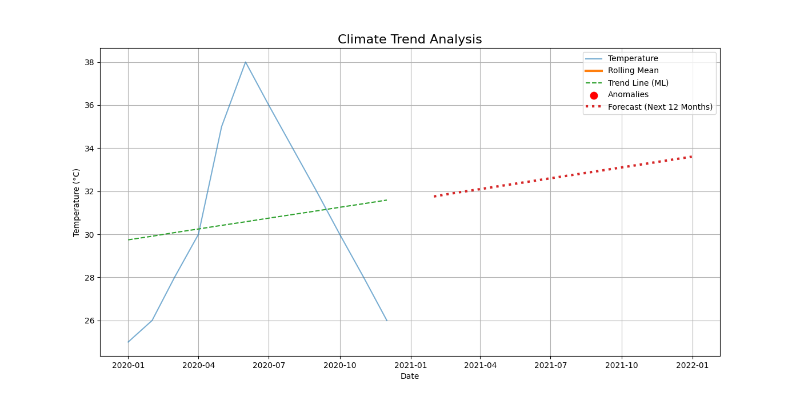

# 🌍 Climate Trend Analyzer

## 📌 Overview

A data science project that analyzes climate data to identify trends, detect anomalies, and forecast future temperature patterns using machine learning.

---

## 🎯 Problem Statement

Understanding climate change requires analyzing long-term environmental data.
This project simulates real-world climate analysis by identifying temperature trends and unusual climate behavior.

---

## 🚀 Features

* 📈 Trend Analysis (Rolling Mean & Regression)
* ⚠️ Anomaly Detection
* 🔮 Temperature Forecasting
* 📊 Data Visualization
* 📁 Exportable outputs

---

## 🛠️ Tech Stack

Python | Pandas | NumPy | Matplotlib | Scikit-learn | Streamlit

---

## 📂 Project Structure

```
Climate-Trend-Analyzer/
│
├── data/
├── outputs/
├── images/
├── main.py
├── app.py
├── requirements.txt
└── README.md
```

---

## ▶️ How to Run

python main.py

For dashboard:
streamlit run app.py

---

## 📊 Output

### 📈 Climate Trend Analysis



---

## 🌐 Live Demo

⚠️ Runs locally only

Run:
streamlit run app.py

---

## 👩‍💻 Author

Aarthi Kole

